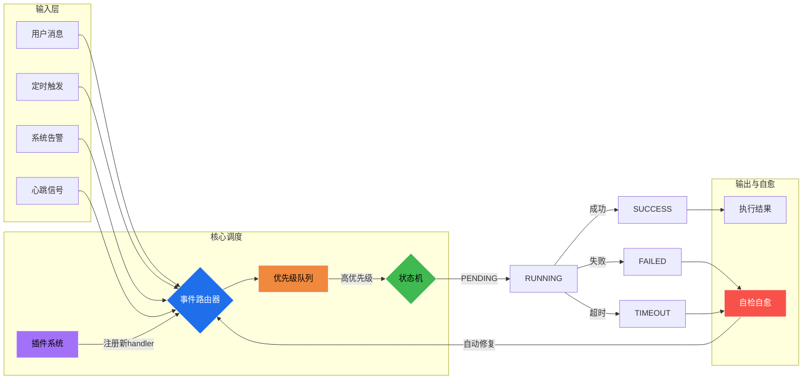

# Agent系统架构设计

> **设计理念**：不是写死逻辑的脚本，是"事件驱动 + 配置即代码 + 自检自愈"的自治系统。

---

## 架构全景图

**Agent总体架构**：从输入、上下文组装、记忆/RAG增强、决策、执行到反馈写回的闭环，加上**持续学习层**让Agent越用越懂你。

```mermaid
---
config:
  theme: 'base'
  themeVariables:
    darkMode: true
    background: '#0a0e17'
    lineColor: '#6e7681'
---

graph LR
    subgraph input["输入层"]
        direction TB
        A[用户消息]
        B[定时触发]
        C[系统告警]
        D[心跳信号]
    end

    E[上下文组装层]

    subgraph core["Agent Core"]
        direction LR
        H[LLM推理+自检]
        I[任务规划]
        J[工具选择]
    end

    subgraph runtime["执行链路"]
        direction LR
        N{执行运行时}
        M[工具层]
        Q[执行结果]
    end

    subgraph memory["记忆 / 知识能力区"]
        direction TB
        K[记忆层]
        L[RAG知识层]
        S[经验写回]
    end

    subgraph learn["持续学习层"]
        direction TB
        T[纠正检测<br/>25+关键词]
        U[模式聚类<br/>置信度评估]
        V[规则升级<br/>写入SKILL.md]
    end

    A --> E
    B --> E
    C --> E
    D --> E
    E --> H
    H --> I
    I --> J
    J --> N
    N --> M
    M --> Q

    K -.->|读取增强| E
    L -.->|检索增强| E
    Q --> S
    S --> K
    S --> L

    A -.->|纠正信号| T
    T --> U
    U -->|置信度≥3| V
    V -.->|升级规则| H

    %% 输入层：深绿底 + 棕绿节点
    style input fill:#0f1f0f,stroke:#2d5a3d,color:#e6f2e6,stroke-width:2px
    style A fill:#2d3b2d,stroke:#4a6b4a,color:#e6f2e6
    style B fill:#2d3b2d,stroke:#4a6b4a,color:#e6f2e6
    style C fill:#2d3b2d,stroke:#4a6b4a,color:#e6f2e6
    style D fill:#2d3b2d,stroke:#4a6b4a,color:#e6f2e6

    %% 上下文：深灰底 + 棕色节点
    style E fill:#2d2a1f,stroke:#5a503a,color:#f2e6c2

    %% Agent Core：深蓝底 + 蓝核心/棕辅助
    style core fill:#0a1628,stroke:#1a3a6b,color:#c9d1d9,stroke-width:2px
    style H fill:#1f6feb,stroke:#58a6ff,color:#fff
    style I fill:#3d2d1f,stroke:#6b5a3d,color:#f2e6c2
    style J fill:#3d2d1f,stroke:#6b5a3d,color:#f2e6c2

    %% 执行链路：深灰底 + 橙菱形/棕节点
    style runtime fill:#151520,stroke:#2d2d44,color:#c9d1d9,stroke-width:2px
    style N fill:#8a6a1f,stroke:#c9a94a,color:#0d1117
    style M fill:#2d2a1f,stroke:#5a503a,color:#f2e6c2
    style Q fill:#2d2a1f,stroke:#5a503a,color:#f2e6c2

    %% 记忆/知识区：深紫底 + 棕记忆/紫RAG/红写回
    style memory fill:#1a0f2e,stroke:#3d1f5c,color:#c9d1d9,stroke-width:2px
    style K fill:#3d2d1f,stroke:#6b5a3d,color:#f2e6c2
    style L fill:#5a3d8a,stroke:#8a6bc7,color:#e6d9f7
    style S fill:#8a2a2a,stroke:#c24a4a,color:#ffe6e6

    %% 持续学习层：深红底
    style learn fill:#2e0f0f,stroke:#5a1f1f,color:#ffe6e6,stroke-width:2px
    style T fill:#5a2a2a,stroke:#8a4a4a,color:#ffe6e6
    style U fill:#5a2a2a,stroke:#8a4a4a,color:#ffe6e6
    style V fill:#8a2a2a,stroke:#c24a4a,color:#ffe6e6
```



**设计要点**：
- **上下文组装**：不是裸输入，而是会话+任务+偏好+检索证据的动态组装
- **Agent Core**：LLM负责推理+自检+规划+工具选择，不是简单调用
- **增强层**：记忆、RAG（含知识图谱）、工具是Agent的基本增强件（参考Anthropic定义）
- **反馈闭环**：执行结果经经验写回更新记忆和知识库，Agent越用越聪明
- **持续学习**：用户纠正（"不对""错了"）→ 检测 → 聚类 → 置信度≥3次 → 升级SKILL.md规则
- **配色语义**：绿=输入、蓝=核心、橙=执行、紫=知识、红=写回/学习，一眼可读

---

## 执行运行时架构（设计亮点）



**设计亮点**：
- **状态机**：PENDING→RUNNING→SUCCESS|FAILED|TIMEOUT，每个任务有明确生命周期
- **优先级队列**：高优先级任务优先执行，队列满丢弃低优先级
- **插件系统**：注册新handler即可扩展，核心代码零侵入
- **自检自愈**：失败/超时自动触发修复，反馈回输入层重新调度

**配置即代码**：`config/agent-system.json` 定义所有行为，不改代码改策略。

---

## 核心设计原则

### 1. 事件驱动（Event-Driven）

系统不是轮询等待，是**事件触发**：
- 用户消息 → 立即响应
- 心跳定时 → 周期检查
- 异常检测 → 自动修复

```python
# 事件路由器示例
def route_event(event_type, payload):
    handlers = {
        "heartbeat": handle_heartbeat,
        "message": handle_message,
        "cron": handle_cron,
        "alert": handle_alert
    }
    return handlers.get(event_type, handle_unknown)(payload)
```

### 2. 检查点机制（Checkpoint）

每个长流程都有检查点，失败时知道从哪里恢复：

```python
# 情报雷达DAG五阶
phases = [
    ("check", "检查点验证"),      # 失败 → 跳过本次
    ("collect", "并行采集"),     # 失败 → 记录重试
    ("analyze", "数据分析"),     # 失败 → 使用缓存
    ("report", "报告生成"),      # 失败 → 告警用户
    ("cleanup", "清理归档")      # 失败 → 下次补清
]
```

### 3. 配置即代码（Config as Code）

所有行为通过配置定义，不改代码就能调整策略：

```yaml
# 心跳配置
heartbeat:
  interval: 4h
  phases:
    - name: warmup
      timeout: 60s
      checks: [alert, calendar]
    - name: full
      timeout: 180s
      checks: [monitor, finance, community, memory]
    - name: fallback
      checks: [cleanup]
  
  # 异常处理策略
  on_failure:
    timeout: skip_and_log
    error: notify_user
```

### 4. 自检自愈（Self-Healing）

系统能检测自身问题并修复：

```python
# 自主修复示例
class SelfHealingAPI:
    def call(self, endpoint, retry=3):
        for attempt in range(retry):
            try:
                return requests.post(endpoint)
            except UnicodeError:
                # 自动修复：中文Header编码问题
                headers = self.fallback_headers()
            except Timeout:
                # 自动修复：指数退避
                time.sleep(2 ** attempt)
        return None
```

---

## 子系统详解

### 1. HEARTBEAT引擎

**三段式执行**：

| 阶段 | 时间 | 目标 | 策略 |
|------|------|------|------|
| 预热 | 第1分钟 | 快速发现异常 | 只检查关键项，超时60s |
| 正式 | 第2-5分钟 | 完整巡检 | 按优先级检查所有项 |
| 兜底 | 第6分钟+ | 处理异常 | 跳过剩余，直接修复 |

**事件流**：
```
[定时触发] → [预热检查] → [异常?] → [是] → [跳过正式] → [修复]
                              → [否] → [正式巡检] → [异常?] → [兜底]
```

### 2. 记忆系统（分层架构）

```
SOUL.md         → 核心人格（只读，永不删除）
MEMORY.md       → 关键记忆（AI精读，§分隔符）
memory/         → 日记日志（RAG索引，自动归档）
RAG知识库       → 检索增强（向量索引，语义搜索）
```

**状态转换**：
- 用户交互 → 写入日记
- 定时归档 → 精华提取到MEMORY.md
- 查询时 → 先MEMORY.md + 再RAG检索

### 3. 工具调度（安全沙箱）

```
用户请求
  → 意图识别
  → 工具选择（MCP协议）
  → 参数校验
  → 执行（带超时）
  → 结果格式化
  → 用户回复
```

**安全机制**：
- 危险操作 → 人工确认（P0级）
- 网络操作 → 限流（429退避）
- 写操作 → 幂等ID（防重复）

### 4. 内容实验系统（A/B测试）

```python
# 五维度评分公式
SCORE_FORMULA = {
    "quantified_data": 0.25,    # 必须有数字
    "concrete_solution": 0.25,  # 必须有方案
    "hook": 0.20,               # 开头抓人
    "structure": 0.15,          # 结构清晰
    "reproducible": 0.15        # 可复现
}

# 实验追踪
experiment = {
    "title": "xxx",
    "predicted_likes": 10,
    "predicted_comments": 4,
    "actual_likes": 12,
    "actual_comments": 5,
    "channel": "乐乐虾"
}
# 预测 vs 实际 → 调整评分权重
```

---

## 容错设计

### 1. 超时熔断

```python
# 情报雷达超时配置
TIMEOUTS = {
    "github": 600,      # 10分钟
    "bilibili": 1200,  # 20分钟
    "producthunt": 300, # 5分钟
    "aibase": 300
}
# 超时 → 记录失败 → 使用缓存 → 下次补采
```

### 2. 降级策略

| 场景 | 正常路径 | 降级路径 |
|------|---------|---------|
| Embedding失败 | sentence-transformers | 随机向量（保留结构） |
| FAISS失败 | 向量检索 | 暴力搜索 |
| LLM失败 | DeepSeek API | 规则引擎兜底 |
| 数据库失败 | SQLite | JSON文件临时存储 |

### 3. 状态持久化

```python
# 标记文件机制（比数据库更轻量）
# 设置任务
with open(".community_learning_trigger", "w") as f:
    f.write(str(time.time()))

# 检查任务
if os.path.exists(".community_learning_trigger"):
    age = time.time() - os.path.getmtime(path)
    if age > 300:  # 5分钟陈旧标记
        print("[陈旧] 优先处理")
    execute_task()
    os.remove(path)  # 完成即删除
```

---

## 扩展性设计

### 1. 插件系统（Skill）

```
skills/
├── skill-name/
│   ├── SKILL.md        # 能力说明
│   ├── scripts/        # 执行脚本
│   ├── config/         # 配置文件
│   └── tests/          # 测试用例
```

**加载方式**：
```python
import importlib.util
spec = importlib.util.spec_from_file_location("skill", "skills/xxx/scripts/main.py")
module = importlib.util.module_from_spec(spec)
spec.loader.exec_module(module)
```

### 2. 配置分层

```yaml
# 全局配置
defaults:
  timeout: 30
  retry: 3
  
# 环境覆盖
dev:
  timeout: 60
  
prod:
  timeout: 30
  retry: 5
  
# 技能特定配置
skill_crawler:
  batch_size: 100
  sleep: [3, 5]  # 随机间隔
```

### 3. 多Agent协作

```python
# 主Agent调度子Agent
sessions_spawn(
    task="测试交易所API",
    timeout=300,
    on_success=handle_result,
    on_failure=handle_error
)

# 状态传递
result = sessions_send(session_key, "继续下一步")
if result["status"] == "error":
    log_and_retry(result)
```

---

## 监控与可观测性

### 1. 日志分级

```python
LOG_LEVELS = {
    "DEBUG": "详细执行步骤",
    "INFO": "关键节点状态",
    "WARN": "异常但可恢复",
    "ERROR": "需要人工介入"
}
```

### 2. 指标采集

| 指标 | 采集方式 | 用途 |
|------|---------|------|
| 心跳延迟 | 定时记录 | 系统健康度 |
| 工具成功率 | 每次调用记录 | 质量监控 |
| 记忆命中率 | 检索对比 | RAG效果 |
| 内容质量分 | 发帖后评估 | A/B优化 |

### 3. 告警机制

```python
# 磁盘告警
if disk_usage > 85%:
    write_alert("disk_alert.json", {
        "level": "warning",
        "message": f"磁盘使用率 {disk_usage}%",
        "action": "auto_cleanup"
    })
```

---

## 总结

这个Agent系统的核心不是"写了多少代码"，是**设计了一个能自我运转、自我修复、自我进化的架构**：

1. **事件驱动** → 响应快，不空转
2. **检查点** → 失败可恢复，不丢状态
3. **配置即代码** → 改配置不改代码，可扩展
4. **自检自愈** → 异常自动处理，减少人工
5. **分层记忆** → 热数据快读，冷数据检索
6. **持续学习** → 从纠正中进化，越用越懂你
7. **基础设施自治** → 磁盘/凭证/日志，系统自己照顾自己

> **不是"写了一个脚本"，是"设计了一个系统"**。

---

## 新增子系统详解

### 持续学习系统（Instinct System）

**设计哲学**：不是写死规则，是让Agent从用户纠正中自己学习。

**工作流**：
```
用户纠正（"不对""错了""不要中英文"）
  → detect_correction.py 检测（25+关键词）
  → instinct_system.py 记录模式
  → 聚类分析（相同模式出现次数）
  → 置信度≥3次
  → 自动写入 SKILL.md 规则
  → Agent下次自动遵守
```

**核心代码**：
```python
# 纠正检测（25+关键词）
CORRECTION_PATTERNS = [
    r"不对[，,]?",
    r"错了[，,]?",
    r"不是[，,]?",
    r"应该是",
    r"不要中英文",
    r"太简单[了]?",
    r"分页[呢]?",
    # ... 25+ 个
]

# 置信度升级
EVOLVE_THRESHOLD = 3  # 出现3次升级为规则
if pattern_count >= threshold:
    write_to_skill_md(pattern, rule)
    print(f"🧬 本能进化: {pattern} → SKILL.md")
```

**实际效果**：
- 用户纠正"不要中英文混用"3次 → 自动写入 `优先使用纯中文回复`
- 用户纠正"分页有问题"3次 → 自动写入 `检查分页/行间距/字体`

### 基础设施自治（Infrastructure）

**不是手动运维，是系统自己照顾自己**。

| 组件 | 功能 | 触发条件 |
|------|------|---------|
| disk_guard.py | 磁盘85%告警+自动清理旧session/报告 | HEARTBEAT每次检查 |
| auto_archive.py | 30天日记自动归档+精华提取到MEMORY.md | 定时 / 会话结束 |
| health_check.py | API凭证过期检测+自动暂停写操作 | 每次操作前 |
| meyo_credential_health.py | 社区API健康检查+自动恢复 | 定时巡检 |

**磁盘清理策略**：
```python
# disk_guard.py
def check_disk():
    usage = get_disk_usage()
    if usage > 85%:
        clean_old_sessions(30_days)
        clean_old_reports(7_days)
        clean_old_raw_data(7_days)
        write_alert("disk_alert.json")
```

**自治效果**：
- 磁盘77% → 自动清理25个旧session，释放5.8MB
- API凭证过期 → 自动检测 → 暂停写操作 → 通知用户 → 恢复后自动续传
