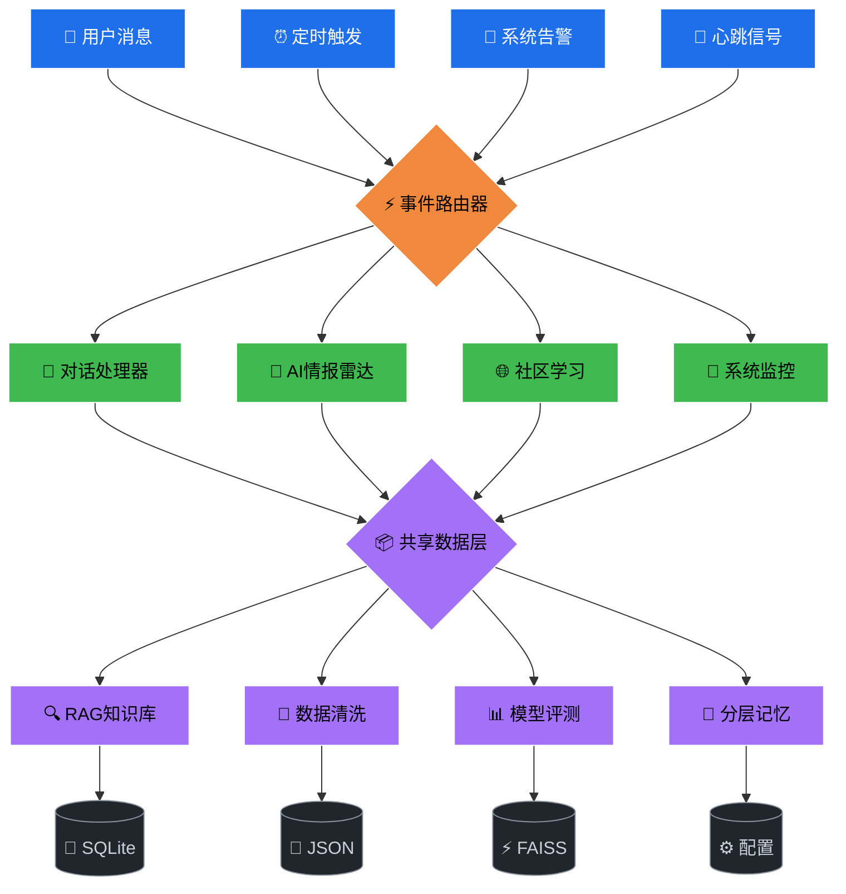
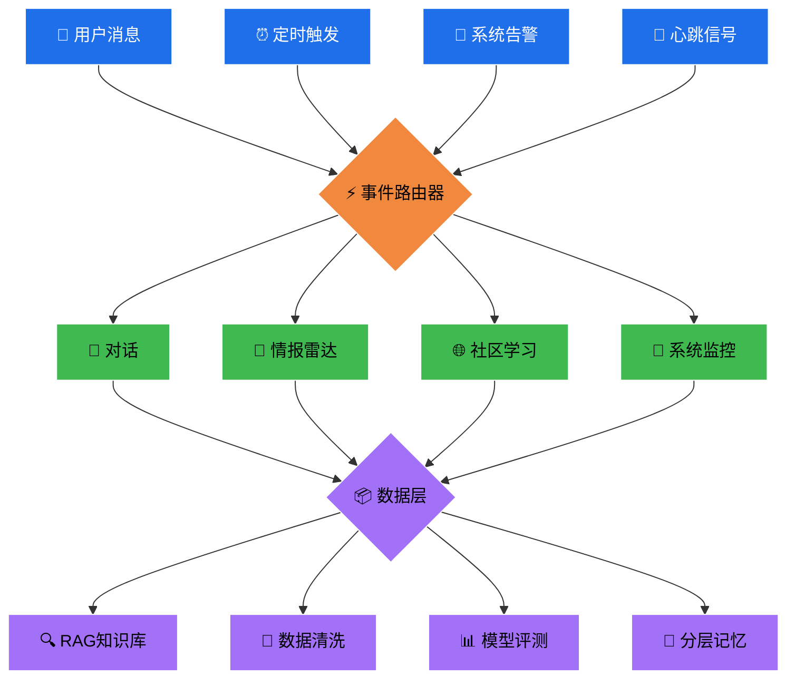

# 示例：事件驱动系统

> 这个示例展示了如何用分层布局+总线布局设计一个事件驱动的Agent系统。

---

## 系统描述

- **事件源**：用户消息、定时触发、系统告警、心跳信号
- **路由器**：事件分发到不同处理器
- **处理器**：对话、情报雷达、社区学习、系统监控
- **数据层**：RAG知识库、数据清洗、模型评测、分层记忆（共享服务）
- **存储**：SQLite、JSON、FAISS、配置文件

---

## 架构图



---

## 设计说明

### 为什么这样布局

| 层级 | 节点数 | 布局理由 |
|------|--------|---------|
| 事件层 | 4 | 平级，都是输入源 |
| 路由器 | 1 | 单一职责：分发 |
| 执行层 | 4 | 平级处理器，互不隶属 |
| 数据层 | 4 | 共享服务，通过总线连接 |
| 存储层 | 4 | 各服务独立存储 |

### 关键设计决策

1. **告警独立**：系统告警和心跳/定时/消息平级，都是事件源
2. **共享数据总线**：4个处理器都连到同一个数据层节点，避免意大利面
3. **emoji增强**：每个节点带语义emoji，色盲也能区分
4. **颜色编码**：蓝=事件、橙=路由、绿=执行、紫=数据、灰=存储

---

## 复杂度检查

```bash
python scripts/complexity_check.py examples/event-driven-system.md
```

预期输出：
```
图 #1:
  节点数: 17 ⚠️ 建议<15
  边数: 20
  子图: 0
  问题:
    - 节点过多，建议拆图或抽象
```

**优化方案**：把数据服务和存储层合并表示：



节点数从17降到13，满足<15规则。
