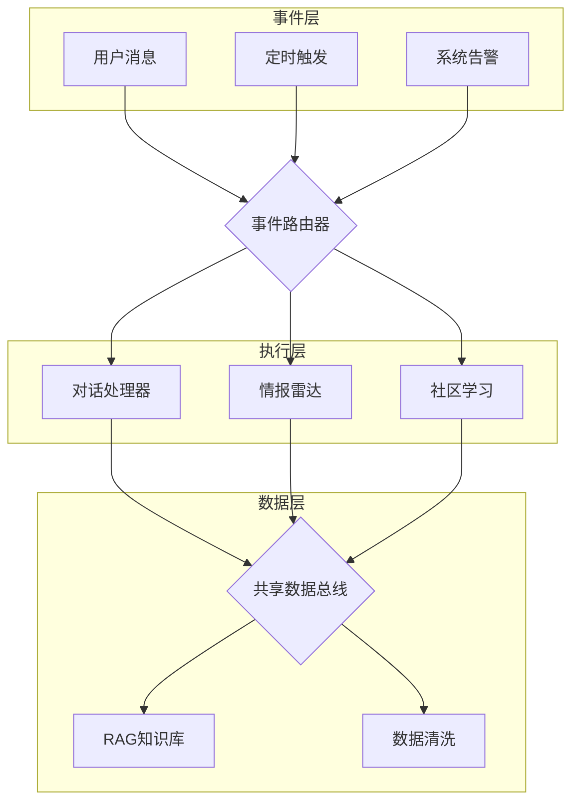
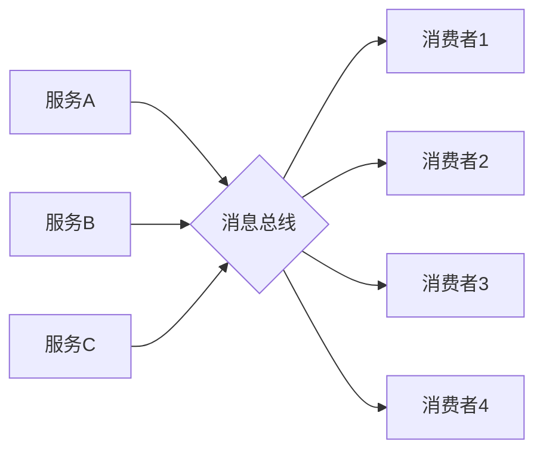
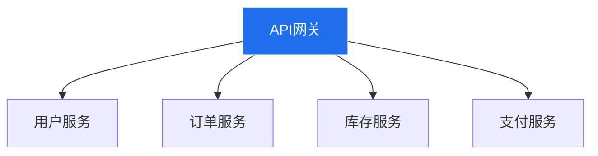
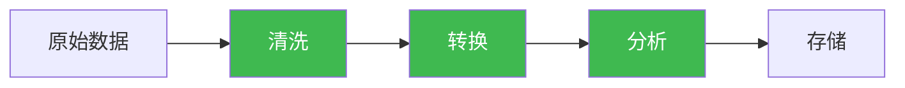
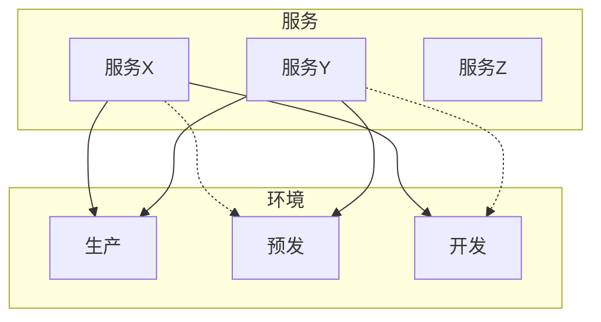

# 布局模式

> 不同场景用不同布局。选错布局=信息传达失败。

---

## 模式1：分层布局（Layered）

**适用**：经典系统架构、请求处理流程

**结构**：
```
[事件源] → [路由器] → [处理器] → [数据层] → [存储层]
```

**要点**：
- 每层职责单一
- 层间箭头单向（避免回环）
- 同层节点平级

**示例**：


---

## 模式2：总线布局（Bus）

**适用**：共享基础设施、微服务通信

**结构**：
```
[多个生产者] → [总线/队列] → [多个消费者]
```

**要点**：
- 总线作为显式节点（不要隐式省略）
- 生产者和消费者数量可以不对等
- 总线可以是消息队列、API网关、共享缓存

**示例**：


---

## 模式3：星型布局（Star）

**适用**：网关模式、中心辐射型系统

**结构**：
```
       [卫星1]
          ↑
[卫星4] ← [中心] → [卫星2]
          ↓
       [卫星3]
```

**要点**：
- 中心节点是单点，要标注高可用/集群
- 卫星节点之间不直接通信（必须经过中心）
- 适合展示API网关、负载均衡器、主从架构

**示例**：


---

## 模式4：管道布局（Pipeline）

**适用**：数据流处理、ETL、构建流水线

**结构**：
```
[输入] → [阶段1] → [阶段2] → [阶段3] → [输出]
```

**要点**：
- 阶段之间有明确的顺序依赖
- 可以画并行分支（阶段2a和2b同时执行）
- 每个阶段标注输入/输出数据格式

**示例**：


---

## 模式5：矩阵布局（Matrix）

**适用**：多对多关系、权限模型、部署拓扑

**结构**：
```
         环境A    环境B    环境C
服务X     ✅       ❌       ✅
服务Y     ✅       ✅       ❌
服务Z     ❌       ✅       ✅
```

**要点**：
- 用表格或网格表示
- 节点用emoji或颜色编码状态
- 适合展示部署矩阵、兼容性矩阵

**Mermaid中用flowchart模拟**：


---

## 模式选择决策树

```
系统类型是什么？
  ├── 请求处理系统 → 分层布局
  ├── 微服务通信 → 总线布局 或 星型布局
  ├── 数据处理流水线 → 管道布局
  ├── 权限/部署拓扑 → 矩阵布局
  └── 混合以上 → 分层+总线组合
```
