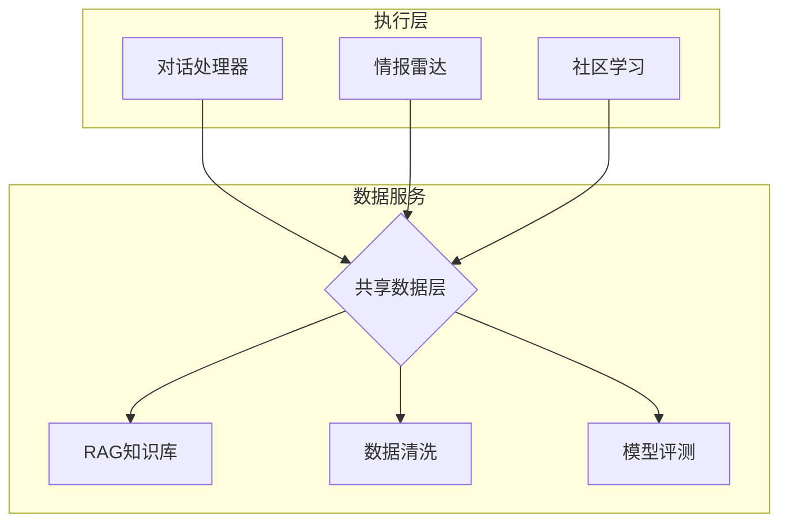

# 核心设计原则

> 架构图是沟通工具，不是代码的图形化翻译。核心目标是：让人一眼看懂系统怎么运转。

---

## 原则1：关系诚实（最重要）

### 问题

垂直对齐会被大脑自动解读为"上下级关系"或"因果关系"。

```
❌ 错误布局（暗示系统告警导致社区学习）：

    [系统告警]
       ↓
    [社区学习]

✅ 正确布局（平级，互不隶属）：

    [系统告警]    [社区学习]
         ↓            ↓
      [共享数据层]
```

### 检查方法

对图中每一对上下相邻的节点，问自己：

> "读者会误以为A是B的父级/触发者吗？"

如果答案是"会"，重新布局。

### 常见陷阱

| 陷阱 | 错误示意 | 修复 |
|------|---------|------|
| 把监控画在业务模块下面 | 监控→金融/社区/爬虫 | 监控与业务平级，都是事件源 |
| 把日志画在存储层 | 存储→日志 | 日志是横切关注点，独立层 |
| 把缓存画在具体服务下面 | 服务A→缓存A | 缓存是共享基础设施 |

---

## 原则2：共享服务用总线

### 问题

多个模块共用同一基础设施时，N×M条箭头会变成意大利面。

```
❌ 错误（6个处理器 × 4个服务 = 24条箭头）：

    [对话] ──→ [RAG]
    [情报] ──→ [RAG]
    [社区] ──→ [RAG]
    ...（重复24次）

✅ 正确（6+4=10条箭头，通过总线）：

    [对话] ──┐
    [情报] ──┼──→ [共享数据总线] ──→ [RAG/清洗/评测/记忆]
    [社区] ──┘
```

### 总线的画法

**Mermaid中**：



---

## 原则3：告警/监控独立

### 核心认知

监控、告警、日志是**横切关注点（Cross-Cutting Concerns）**，不是任何业务模块的子功能。

```
❌ 错误（告警嵌套在心跳里）：

    [HEARTBEAT]
       ├── 预热 → [告警检查]
       └── 正式 → [完整巡检]

✅ 正确（告警是独立事件源）：

    [用户消息] [定时触发] [系统告警] [心跳信号]
         ↓          ↓          ↓          ↓
              [事件路由器]
```

### 什么时候画进架构图

| 场景 | 是否画监控 | 原因 |
|------|-----------|------|
| 对外展示系统能力 | ✅ | 体现"自检自愈"设计 |
| 内部开发文档 | ⚠️ 可选 | 看读者是否需要 |
| 面试/求职 | ✅ | 展示架构思维 |

---

## 原则4：复杂度控制

### Miller's Law

人类工作记忆容量：**7±2个信息块**。

**规则**：
- 单层节点 ≤ 7
- 整张图节点 ≤ 15
- 超过就分组、抽象、拆图

### 抽象方法

```
原始（15个节点）：
    [用户] → [网关] → [服务A1] [服务A2] [服务A3] [服务B1] [服务B2] ...

抽象后（7个节点）：
    [用户] → [网关] → [服务组A] [服务组B] [服务组C]
                          ↓
                       [详情展开图]
```

---

## 原则5：可描述性

画完图后，必须能用**一句话**描述核心信息。

| 好描述 | 坏描述 |
|--------|--------|
| "事件驱动的自治系统，4类事件通过路由器分发到处理器，共享数据层提供检索/清洗/评测/记忆服务" | "这是我们系统的所有模块" |
| "用户请求经过网关路由到3个微服务，通过消息队列解耦" | "这是微服务架构" |

**测试**：把图给不看代码的人看10秒，让他复述。如果复述不出来，图太复杂。
