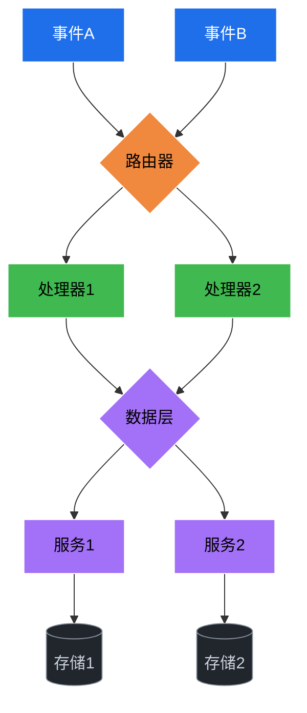

# 架构图模板

> 画架构图时，复制这个模板，填空即可。

---

## 步骤1：一句话描述

\[系统名称\] 是一个 \[事件驱动/微服务/流水线\] 系统，核心能力是 \[一句话\]。

示例：
> AI情报雷达是一个事件驱动的采集分析系统，核心能力是每日自动采集4源AI动态并生成结构化报告。

---

## 步骤2：选择布局模式

- [ ] 分层布局（请求处理系统）
- [ ] 总线布局（共享基础设施）
- [ ] 星型布局（网关模式）
- [ ] 管道布局（数据处理流）
- [ ] 矩阵布局（多对多关系）

---

## 步骤3：确定层级

```
第1层 [事件源/输入]：____________________
第2层 [路由/分发]：____________________
第3层 [处理/执行]：____________________
第4层 [数据/服务]：____________________
第5层 [存储/输出]：____________________
```

---

## 步骤4：画Mermaid图



---

## 步骤5：自检清单

- [ ] 纵向对齐是否暗示了不存在的因果关系？
- [ ] 共享服务是否用总线/共享层表示？
- [ ] 告警/监控是否作为独立横切层？
- [ ] 单层节点数 ≤ 7？
- [ ] 总节点数 ≤ 15？
- [ ] 所有颜色对比度 ≥ 4.5:1？
- [ ] 可以用一句话描述这张图？
- [ ] 有标题和图例？

---

## 步骤6：运行检查脚本

```bash
# 对比度检查
python scripts/contrast_check.py --bg #21262d --fg #c9d1d9

# 复杂度检查
python scripts/complexity_check.py your-diagram.md --validate
```

---

## 示例输出

```
图 #1:
  节点数: 10 ✅
  边数: 12
  子图: 0
  ✅ 复杂度正常
```
